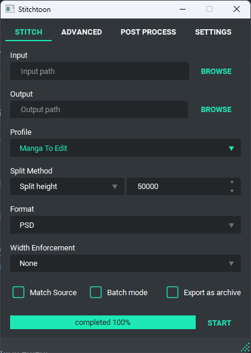

<div align="center">
  <a href="https://github.com/BishrGhalil/stitchtoon-gui">
    
  </a>
  <h1>StitchToon GUI</h1>
  <p>
    The ultimate tool for working with webtoons/manhwa/manhua raws.
  </p>
    <p>
    A Graphical User Interface for <a href="https://github.com/BishrGhalil/stitchtoon"><b>stitchtoon</b></a> written in Python and Qt6.
    </p>
  <a href="https://github.com/BishrGhalil/stitchtoon-gui/releases/latest">
    
  </a>
  <a href="https://github.com/BishrGhalil/stitchtoon-gui/releases/latest">
    
  </a>
  <a href="https://github.com/BishrGhalil/stitchtoon-gui/tree/dev">
    
  </a>
  <a href="https://github.com/BishrGhalil/stitchtoon-gui/blob/dev/LICENSE">
    
  </a>
</div>

## Features over SmartStitch
Stitchtoon is a fork of SmartStitch, However it offers much more features like:
- An option to split into a specific number of images.
- Auto conversion between `PSD` and `PSB` when maximum size exceeded.
- Batch mode is optional.
- Better code which is easier to maintain.
- Better errors handling, It won't simply fail without telling you why.
- Better logs, disabled by default.
- Better output names, It won't output as `[stitched]`.
- Better progress bar.
- Dark and light themes with multiple accents.
- Environment variables in post-process arguments.
- Export as archive.
- New mode for width enforcement.
- New version notifier.
- Post-process output will be shown.
- Tools Tips all over the interface.
- Transparency support.

### Screenshots



## Download

### Windows
You can find installers and portables on the [releases](https://github.com/BishrGhalil/stitchtoon-gui/releases) page.

### Linux, MacOS
Install from source
```
git clone https://github.com/BishrGhalil/stitchtoon-gui
cd stitchtoon-gui
pip instal --user requirements.txt
pip install .
stitchtoon-gui
```

## Help

**Request a feature**

You are welcome to request a feature by reporting an [issue](https://github.com/BishrGhalil/stitchtoon-gui/issues) for any feature request.

**When something goes wrong:**
- Try to reset the settings by following this steps:

    - Windows:
    open a powershell in the executable directory then:
    `stitchtoon.exe --reset`


    - Linux and MacOS:
    `stitchtoon-gui --reset`

- Or run in debug mode and report an [issue](https://github.com/BishrGhalil/stitchtoon-gui/issues) with the log file.
    - Windows: navigate to the executable directory and run:
    `stitchtoon.exe --debug`
    reproduce the error and a log file will be located at your `Desktop`
    - Linux and MacOS:
    `stitchtoon-gui --debug`
    reproduce the error and a log file will be located at your `$HOME`
